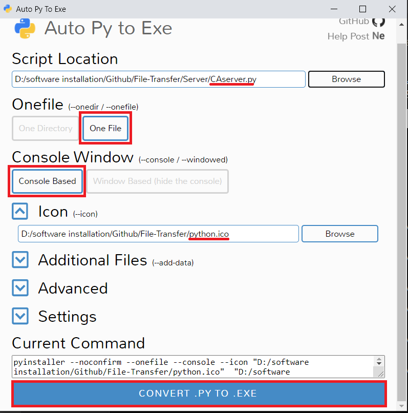

# File-Transfer

This is socket programming in python, that is written with reference from Socket-Programming from gulshan-mittal
https://github.com/gulshan-mittal/Socket-Programming

## How to use (.py file)

1. Place the file (with an extension) (not a folder) into the Data folder
2. Run the CAserver.py with the PC containing the file
3. Run the CAclientNP.py/CAclientP.py with the PC receiving the file (another PC)
4. Key in the IP address that appears on the Server program into the Client program

## How to build (.exe file)

1. pip install auto-py-to-exe
2. Run "auto-py-to-exe" in cmd prompt
3. Compile CAserver.exe, CAclientNP.exe and CAclientP.exe with CAserver.py, CAclientNP.py and CAclientP.py respectively. (A sample image is shown below.)

## How to use (.exe file)

1. Just run the exe file